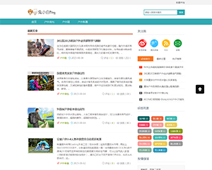

## Cyans Theme for Typecho

### 简介

Cyans 是一款简洁的响应式Typecho主题。



### 说明

- 主题默认使用 [Disqus][1] 评论系统，同时也提供Typecho原生评论系统，请按下列说明进行设置。
- 主题默认使用了[Hanny][2]的浏览量统计插件(Stat)，请按下列说明上传并安装。
- 主题的侧栏友链使用了[Hanny][2]的友链插件(Links)，请按下列说明上传并安装。
- 主题演示地址：[LYVNEE'S BLOG][3]

### 安装

##### 主题安装

- 下载此分支文件重命名为`Cyans`，上传至站点`/usr/themes/`，通过`控制台`->`外观`启用主题，在`设置外观`中做相关设置。

##### 插件安装

- 按照`plugins`分支中的说明，自行安装相关插件。

##### 评论系统安装

- 主题默认使用Disqus评论系统，同时也提供Typecho原生评论系统，可在后台`控制台`->`外观`->`设置外观`->`评论系统选择`中选择原生评论系统。

- 使用默认设置请注册[Disqus][1] 并创建自己的 `Disqus Website Shortname`。

- 在后台`控制台`->`外观`->`设置外观`->`Disqus评论系统设置`中按说明填写自己的`Disqus Website Shortname`即可，`comments.php`中相关代码已经设置好**请勿随意修改**。

### 功能

#### 撰写文章界面

- 代码高亮，在使用Markdown写文章时，只要在代码块标记` ``` `后面添加你的代码的语言名，如php、html、python等，就可以实现代码高亮展示。

- 自定义文章摘要，代替Typecho默认的根据<!--more-->标签截取和模板默认使用的文本截取输出摘要。

- 自定义文章许可，临时修改在后台设置好的默认许可协议。

### 许可

MIT License

[1]: https://disqus.com/
[2]: http://www.imhan.com
[3]: https://lyvnee.com/
